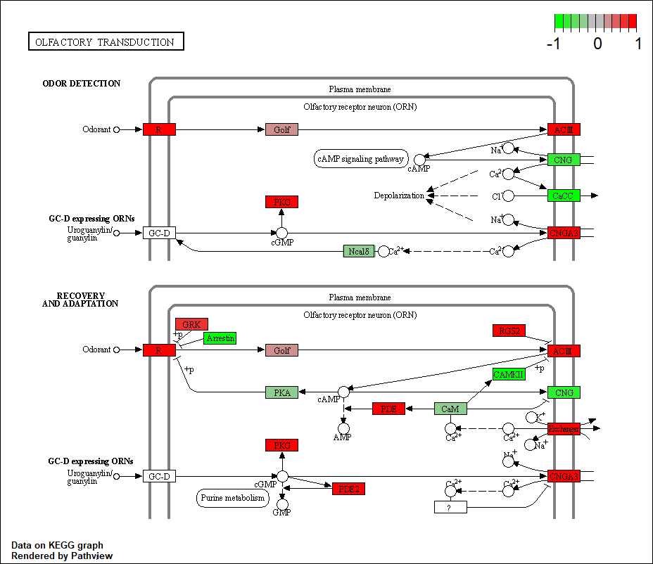
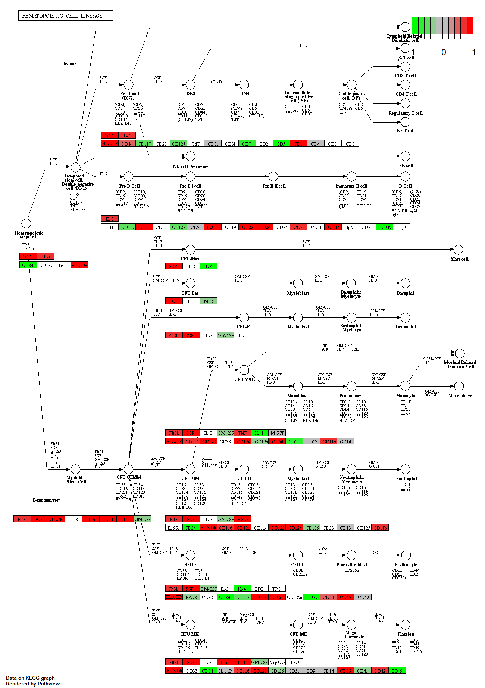
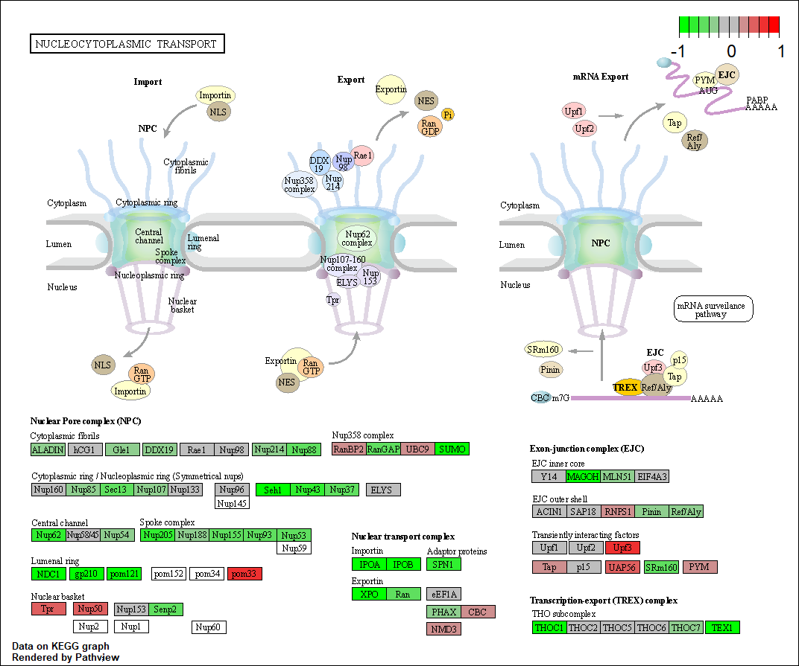

```{r}
library(DESeq2)
```

```{r}
metaFile <- "GSE37704_metadata.csv"
countFile <- "GSE37704_featurecounts.csv"

# Import metadata and take a peak
colData = read.csv(metaFile, row.names=1)
head(colData)
```
```{r}
# Import countdata
countData = read.csv(countFile, row.names=1)
head(countData)
```
Q. Complete the code below to remove the troublesome first column from countData

```{r}
# Note we need to remove the odd first $length col
countData <- as.matrix(countData[,-1])
head(countData)
```
Q. Complete the code below to filter countData to exclude genes (i.e. rows) where we have 0 read count across all samples (i.e. columns).

Tip: What will rowSums() of countData return and how could you use it in this context?


```{r}
# Filter count data where you have 0 read count across all samples.
head( rowSums(countData) )
head( rowSums(countData) == 0)
nonzero.ind <- rowSums( countData ) != 0
countDataFiltered <- countData[ !zero.ind, ]
head(countDataFiltered)
```
```{r}
dds = DESeqDataSetFromMatrix(countData=countData,
                             colData=colData,
                             design=~condition)
dds = DESeq(dds)
```
```{r}
dds
```
```{r}
res = results(dds, contrast=c("condition", "hoxa1_kd", "control_sirna"))
```

Q. Call the summary() function on your results to get a sense of how many genes are up or down-regulated at the default 0.1 p-value cutoff.

```{r}
nrow(countDataFiltered)
```

```{r}
summary(res)
```

```{r}
#27% are upregulated and 27% are downregulated. By calling `summary` with a different argument, we can change the p-value threshold.
summary(res, alpha = 0.1)
```
Now we will make a volcano plot, a commonly produced visualization from this type of data that we introduced last day. Basically it's a plot of log2 fold change vs -log adjusted p-value.

```{r}
plot( res$log2FoldChange, -log(res$padj) )
```
Q. Improve this plot by completing the below code, which adds color and axis labels

```{r}
# Make a color vector for all genes
mycols <- rep("gray", nrow(res) )

# Color red the genes with absolute fold change above 2
mycols[ abs(res$log2FoldChange) > 2 ] <- "red"

# Color blue those with adjusted p-value less than 0.01
#  and absolute fold change more than 2
inds <- (res$padj<0.01) & (abs(res$log2FoldChange) > 2 )
mycols[ inds ] <- "blue"

plot( res$log2FoldChange, -log(res$padj), col=mycols, xlab="Log2(FoldChange)", ylab="-Log(P-value)" )
```
Q. Use the mapIDs() function multiple times to add SYMBOL, ENTREZID and GENENAME annotation to our results by completing the code below.
#### Adding Gene Annotation
```{r}
# Load libraries
library("AnnotationDbi")
library("org.Hs.eg.db")
# Inspect columns available in annotation file
columns(org.Hs.eg.db)
# Add the column "symbol" to our DEG results
res$symbol = mapIds(org.Hs.eg.db,
                    keys=row.names(res), 
                    keytype="ENSEMBL",
                    column="SYMBOL",
                    multiVals="first")
# Add the column "entrez" to our DEG results
res$entrez = mapIds(org.Hs.eg.db,
                    keys=row.names(res),
                    keytype="ENSEMBL",
                    column="ENTREZID",
                    multiVals="first")
# Add the column "name" to our DEG results
res$name =   mapIds(org.Hs.eg.db,
                    keys=row.names(res),
                    keytype="ENSEMBL",
                    column="GENENAME",
                    multiVals="first")

head(res, 10)
```
Q. Finally for this section let's reorder these results by adjusted p-value and save them to a CSV file in your current project directory.

```{r}
res <- res[order(res$padj),]
write.csv(res, file = "deseq_results.csv")
```

```{r}
# Run in your R console (i.e. not your Rmarkdown doc!)
#BiocManager::install( c("pathview", "gage", "gageData") )

# For old vesrsions of R only (R < 3.5.0)!
#source("http://bioconductor.org/biocLite.R")
#biocLite( c("pathview", "gage", "gageData") )
```

```{r}
library(pathview)
```

```{r}
library(gage)
library(gageData)

data(kegg.sets.hs)
data(sigmet.idx.hs)

# Focus on signaling and metabolic pathways only
kegg.sets.hs = kegg.sets.hs[sigmet.idx.hs]

# Examine the first 3 pathways
head(kegg.sets.hs, 3)
```
```{r}
foldchanges = res$log2FoldChange
names(foldchanges) = res$entrez
head(foldchanges)
```
```{r}
# Get the results
keggres = gage(foldchanges, gsets=kegg.sets.hs)
```

```{r}
attributes(keggres)
```
```{r}
# Look at the first few down (less) pathways
head(keggres$less)
```
```{r}
pathview(gene.data=foldchanges, pathway.id="hsa04110")
```
```{r}
# A different PDF based output of the same data
pathview(gene.data=foldchanges, pathway.id="hsa04110", kegg.native=FALSE)
```
```{r}
## Focus on top 5 upregulated pathways here for demo purposes only
keggrespathways <- rownames(keggres$greater)[1:5]

# Extract the 8 character long IDs part of each string
keggresids = substr(keggrespathways, start=1, stop=8)
keggresids
```
```{r}
pathview(gene.data=foldchanges, pathway.id=keggresids, species="hsa")
```




Q. Can you do the same procedure as above to plot the pathview figures for the top 5 down-reguled pathways?

```{r}

## Focus on top 5 downregulated pathways here for demo purposes only
keggrespathways1 <- rownames(keggres$less)[1:5]

# Extract the 8 character long IDs part of each string
keggresids1 = substr(keggrespathways1, start=1, stop=8)
keggresids1
```
```{r}
pathview(gene.data=foldchanges, pathway.id=keggresids1, species="hsa")
```





```{r}
data(go.sets.hs)
data(go.subs.hs)

# Focus on Biological Process subset of GO
gobpsets = go.sets.hs[go.subs.hs$BP]

gobpres = gage(foldchanges, gsets=gobpsets, same.dir=TRUE)

lapply(gobpres, head)
```
```{r}
sig_genes <- res[res$padj <= 0.05 & !is.na(res$padj), "symbol"]
print(paste("Total number of significant genes:", length(sig_genes)))
```
```{r}
write.table(sig_genes, file="significant_genes.txt", row.names=FALSE, col.names=FALSE, quote=FALSE)
```
Q: What pathway has the most significant “Entities p-value”? Do the most significant pathways listed match your previous KEGG results? What factors could cause differences between the two methods?
Endosomal and vacuolar pathway
